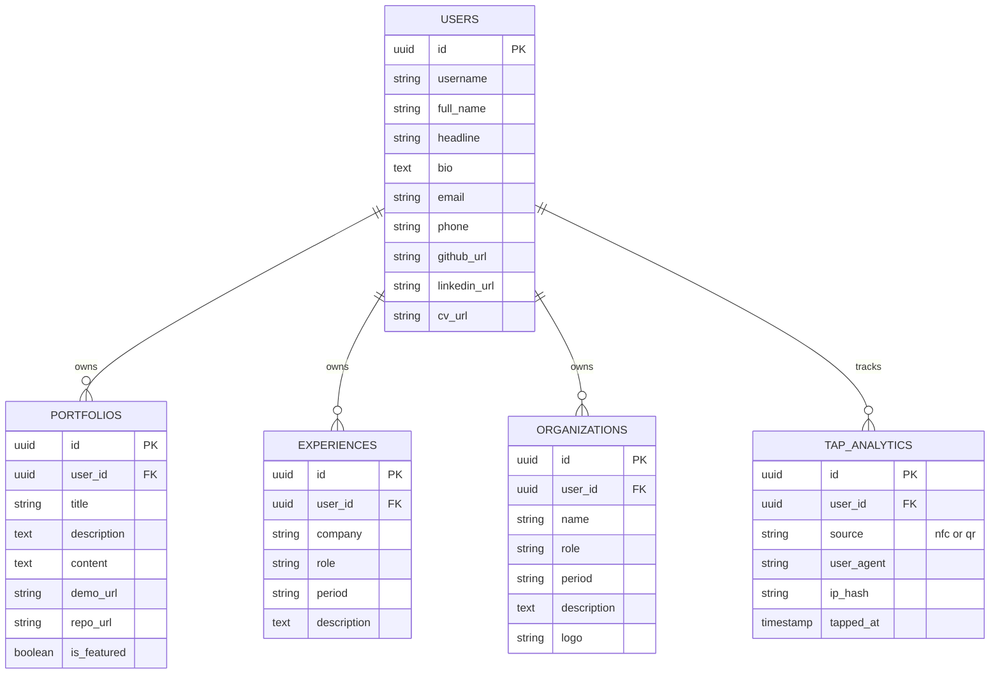

# 💳 Smart NFC Academic & Portfolio Card


A high-end, full-stack digital portfolio ecosystem designed to bridge physical networking and digital presence. Triggered by a physical NFC/QR card, this platform delivers a stunning, interactive, and highly optimized UI/UX experience while dynamically tracking interactions.

---

## 📑 Product Requirements Document (PRD)

### Problem Statement
Traditional paper business cards are obsolete, and static link-in-bio pages lack professional depth and analytical tracking for serious tech recruiters or networking events.

### Solution
A physical NFC card that, when tapped, routes users to a dynamic, Awwwards-inspired Next.js portfolio. It serves as a unified hub for a developer's identity, featuring comprehensive case studies, interactive UI, a direct vCard download, and real-time tracking via a dedicated Express.js backend.

### Target Audience
- Tech Recruiters & Talent Acquisition
- Event Networkers (Hackathons, Tech Conferences)
- Fellow Engineers & Designers

---

## 🏗️ System Architecture

The ecosystem relies on a decoupled **Dual-Engine Architecture**:

1. **Frontend (Vercel / Edge Network):** Built with Next.js 14 App Router. Handles SSR/SSG rendering, smooth scroll, and Framer Motion animations.
2. **Backend (Render.com):** A modular Node.js/Express REST API serving as the brains. Handles rate limiting, Zod validation, and webhooks.
3. **Database (Supabase Cloud):** PostgreSQL relational database with Row Level Security (RLS) and Storage buckets for CVs and thumbnails.
4. **Alert System:** Nodemailer / Webhook integration routing contact forms directly to the owner's devices.

---

## 🗄️ Entity Relationship Diagram (ERD)



---

## ✨ Core Features

- **Anti-Slop Design:** Adheres strictly to the *Taste-Skill* UI framework (No em-dashes, WCAG AA Contrast, Dark Neon Glassmorphism).
- **Interactive Awwwards UI:** Magnetic buttons, custom cursor blend modes, scroll-reveal staggered typography, and 3D parallax tilt cards.
- **Secret CMS Dashboard:** Hidden Easter Egg login to access a secure `/admin/content` control panel for managing projects, experiences, and uploading CVs.
- **NFC Tap Analytics:** Tracks physical card taps, distinguishing between NFC, QR, and direct links, visualized in a Recharts dashboard.
- **Dynamic Routing:** Markdown-supported case study detail pages (`/project/[id]`) with 60FPS fluid image galleries.

---

## 💻 Tech Stack

### Frontend
- **Framework:** Next.js 14 (App Router) + TypeScript
- **Styling:** Tailwind CSS v4, Glassmorphism techniques
- **Animations:** Framer Motion, Lenis (Smooth Scroll)
- **Icons & Data:** Lucide React, React Markdown, Recharts

### Backend
- **Framework:** Node.js, Express.js (Modular MVC Pattern)
- **Security:** Zod (Validation), Express-Rate-Limit
- **Database:** Supabase (PostgreSQL + Storage Buckets)
- **Services:** Nodemailer (SMTP Routing)

---

## 🚀 Local Development Setup

1. **Clone the Repository**
   ```bash
   git clone https://github.com/Nayaka-Samuell/nayaka-portfolio.git
   cd nayaka-portfolio
   ```

2. **Setup Backend**
   ```bash
   cd backend
   npm install
   # Copy env config
   cp .env.example .env
   # Add your Supabase Keys to .env
   
   # Seed Initial Database
   npm run seed
   
   # Start Dev Server
   npm run dev
   ```

3. **Setup Frontend**
   ```bash
   cd ../frontend
   npm install
   # Copy env config
   cp .env.example .env.local
   # Ensure NEXT_PUBLIC_API_URL=http://localhost:5000
   
   # Start Next.js Server
   npm run dev
   ```

4. **Access the App**
   - Main Site: `http://localhost:3000`
   - Secret CMS Admin: `http://localhost:3000/admin/content`
   - Backend API: `http://localhost:5000`

---
*Developed with extreme engineering discipline by Nayaka Samuel Andrean.*
